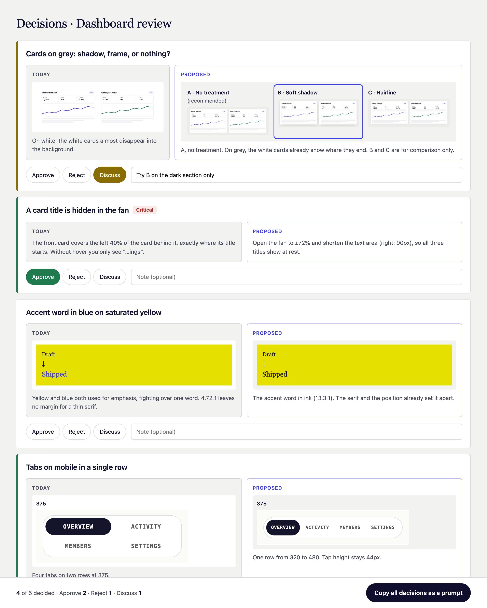

# Decision review

> **Beta.** It works, I use it daily, and I'd love to hear where it breaks for you. See [Feedback](#feedback).

A Claude Code skill that turns a pile of proposals into a page you decide on.

When an agent reviews your design, it usually answers with a long list you have to read, picture in your head, and reply to in text. With this skill it opens a page instead: one card per proposal, **Today** next to **Proposed**, and three buttons. You look, click, add a note where you disagree, and one button copies every decision back to Claude as a prompt.



## Credit

The idea comes from Kyle Zantos, who showed his review interface for agent proposals on [Dive Club](https://www.dive.club/deep-dives/kyle-zantos-3) (August 2026): gather the proposals, approve, deny or discuss each one, and copy every decision back into the session. This is an open implementation of that approach.

## Why it's cheap

Claude never writes the page. It writes one short `findings.json`, and a small Python script turns it into HTML. A review round costs a few hundred tokens of data, not a hand-built page every time.

## Requirements

- [Claude Code](https://claude.com/claude-code)
- Python 3.8+ (builds the page, no packages needed)
- Optional, for before/after screenshots: Node 22+ and Google Chrome. Without them you still get the page, with text and color swatches instead of screenshots.

## Install

**Claude Code (recommended).** Two commands, then start a new session:

```bash
claude plugin marketplace add batchencba-beep/decision-review
claude plugin install decision-review@batchenba
```

Updates later: `claude plugin update decision-review@batchenba`.

**Claude desktop or web app.** Download this repo as a ZIP and upload it in **Customize → Plugins → Upload plugin**. The decision page works there too; the screenshot script needs Node and Chrome, so in the apps expect text and swatches rather than screenshots.

**By hand.** Copy `skills/decision-review` into `~/.claude/skills/` (every project) or into a project's `.claude/skills/` (that project only).

## Use

Ask for it directly:

> Review the homepage and give me a decision page.

Or just run a review: the skill tells Claude to use the page whenever more than two or three changes are waiting on you. When you're done deciding, click **Copy all decisions as a prompt** and paste it back into the chat. Approved items get applied, rejected ones stay as they are, notes override the proposal, and Discuss items get an answer before anything changes.

### A session, start to finish

1. You: "Review the pricing page and give me a decision page."
2. Claude reviews it, screenshots each thing it wants to change as it is and as proposed, writes a short `findings.json`, builds the page and opens it.
3. You go through the cards: Approve, Reject or Discuss, pick an option where there's a choice, add a note where you disagree.
4. You click **Copy all decisions as a prompt** and paste it into the chat.
5. Claude applies what you approved, leaves the rest, answers the Discuss items, and tells you what it changed.

Your clicks are saved in the browser, so you can close the page and come back. A new review round with different items starts clean.

To try it by hand, without touching the skill folder:

```bash
cp -r skills/decision-review/example /tmp/decision-review-example
cd /tmp/decision-review-example
python3 /path/to/decision-review/skills/decision-review/build.py findings.json decisions.html
open decisions.html
```

## Figma files and decks

It isn't only for web pages. Point Claude at a Figma file or a deck and it reviews the frames, crops what matters, and shows the proposal next to it. With a Figma connector it takes the frames itself; without one, export them and it works from the images.

## Pages behind a login

Most real screens sit behind a sign-in. The first time Claude needs one, it opens a normal Chrome window on the app's sign-in page. You sign in yourself and close the window, and from then on screenshots are taken as you, signed in.

That window uses a separate Chrome profile that belongs only to this tool, stored in `~/.decision-review/`. Claude never sees or types your password, and your own Chrome profile, cookies and passwords are never touched. To delete the saved session: `node skills/decision-review/shoot.mjs --logout`, or delete that folder.

## What it does on your computer

- **Nothing leaves your machine.** The page builder makes no network calls, and the decision page loads nothing from the internet. Your decisions are saved only in your browser.
- **Screenshots** open only the address being reviewed, in a separate Chrome profile: a temporary one that's deleted after each shot, or the saved sign-in profile above.
- **Small and readable.** Two scripts, about 600 lines in total, no dependencies to install.
- **You see every command.** Claude Code asks before it runs anything, unless you've told it not to.

## What's inside

| File | What it does |
|---|---|
| `SKILL.md` | Instructions for Claude: when to use it, the JSON schema, how to write the cards |
| `build.py` | Turns `findings.json` into the page, and explains what's wrong if the JSON isn't right |
| `shoot.mjs` | Screenshots one element of a page, as it is or with proposed CSS applied, signed in if needed |
| `example/` | A ready example to build and open |

## What's in a card

- A title, and a **Critical** badge only when something is broken
- **Today** and **Proposed**: one or two sentences each, plus screenshots, a live swatch, or 2 to 4 options to choose between
- Approve, Reject, Discuss, and a note
- Decisions are saved in the browser, so you can close the page and come back

**Language.** The page comes in the language you talk to Claude in. English and Hebrew are built in (Hebrew renders right to left, and mixed Hebrew/English text keeps its direction). Want the other one? Just say "decision pages in English" or "בעברית". Any button label can be changed with `"labels"` in the JSON.

## Feedback

This is a beta. If something breaks, reads wrong, or you wish a card worked differently, open an [issue](../../issues) or message me on [LinkedIn](https://www.linkedin.com/in/bat-chen-ben-arza-255a48217). A screenshot of the page and the `findings.json` that produced it help the most.

## License

MIT
